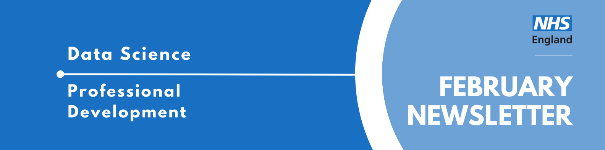

Welcome to the latest newsletter from the Data Science Community for Health and Care, brought to you by the NHS England Data Science Professional Development Functional Team. 

The newsletter team are always happy to receive constructive feedback, and we invite you to send us any contributions you may have. 

If you cannot access something of interest to you, please [reach out](https://github.com/nhsengland/datascience-pd-newsletter/issues/new){target="_blank"}. 

Thanks for reading! – newsletter team 

# Interview with a Data Scientist - The Path of Most Resistance - How I Became an NHS Data Scientist Without Going to University

Welcome to another installment of our "Interview with a Data Scientist" series, where we explore the careers and work of the talented Data Scientists across NHS England. We aim to showcase the fantastic individuals who contribute to the NHSE Data Science Profession and provide valuable insights for those considering a career in Data Science within the healthcare sector.

This week our interviewee is Mary Amanuel, a Data Scientist at NHS England who bypassed university to become the first-ever apprentice at NHSX, proving that a background in high-stakes digital advertising and a drive for social good can be just as powerful as a traditional degree.

  
Read more...

### How did you end up in data science in your healthcare organisation? What did you do before, and what really sparked your interest in this field?

Before joining the NHS, I went straight from getting my A-level results to working full time in the fast-paced world of digital media advertising. Facebook, YouTube, Google Ads, online newspaper ads, TV spots. You name the platform and I was probably running a client's campaign on it. You may have even seen one of them.

I worked across all kinds of budgets, from tiny to enormous, but the principles were largely the same: set a clear objective, figure out who your target audience actually is, run experiments like A/B testing to check whether your ad resonates, negotiate the best placements to reach that audience, and then measure whether any of it actually worked.

What I loved most was the experimentation and measurement side of things. I found myself writing blogs, supporting the insight team with tracking studies on Brits' attitudes and behaviours, and building dashboards for clients.

But I could also see this path was at high risk of automation. In the new era of programmatic advertising, where algorithms automatically buy and sell ad space to reach the right audience, I knew how hard it would be to out-optimise a machine over the long term. So, I decided to lean into the skills I genuinely enjoyed and cared about: working with data, helping people, and doing something meaningful. That is when I made the pivot towards data analytics and data science, driven by a real desire to use those skills for social good.

The catch was that I only had A-levels. Data analytics and data science roles had thick educational glass ceilings, and while apprenticeships were starting to appear, they were still quite rare. There was also a certain snobbery about the non-traditional route.

So I cast the net as wide as possible and applied everywhere I could, until an opportunity came up to interview at NHSX, a fascinating new unit sitting at the intersection of health and technology. I took my chance and became their first data analytics apprentice.

### Once you joined the NHS, what was that experience like? What different roles and teams have you been a part of, and how have they shaped your career?

NHSX was radical. On paper it was a joint unit of NHS England, NHS Improvement, and the Department of Health and Social Care, but in reality it felt more like a start-up. Private sector pace in the skin of a public sector organisation.

Within my first two weeks I was redesigning the NHS App Dashboard. Within a month I was supporting the first NHSX AI Lab Skunkworks project, Data Lens, a fast-access data search tool in multiple languages. By month two we were building the NHS Python Community for Healthcare, championing open source during the national COVID-19 response. I worked across everything from data engineering to health economics, providing analytical resource to NHS programmes that genuinely needed it.

Before NHSX was merged into NHS England and NHS Improvement, I took a promotion into the Economics and Strategic Analysis team, which brought together economists, behavioural scientists, and analysts to deliver high-stakes data science work at the height of the pandemic. It was here that I worked on projects like the COVID-19 Early Warning System and built econometric models for elective recovery that went on to earn third place in the 2023 John Hoy Memorial Prize in Economics.

Now, as NHS England moves towards merging with the Department of Health and Social Care, I find myself in my third role in the organisation. The NHS (and data science) looks very different now than when I joined in 2020.

Throughout all of it, I was completing a degree apprenticeship (at Multiverse - which is an apprenticeship organisation that can award degrees in England), a BSc in Digital and Technology Solutions with a focus on data science, engineering, and machine learning. Doing that alongside full-time work across three roles was not always easy, but it meant that everything I studied I could immediately apply. I would not have had it any other way.

### What are you currently working on? Are there any projects that you’re particularly excited about, or that you feel are making a real difference? What impact are you having?

I feel genuinely fortunate to work across health economics, data science, AI, and community projects. My current work spans three areas:

* Using machine learning to predict which patient cohorts are at higher risk of developing cancer in the coming year, directly informing early detection efforts with the national cancer programme.
* Building econometric models and visualisations with the urgent and emergency care teams to understand what actually drives performance in emergency departments, isolating what levers policy and operational teams have to pull to influence performance
* Experimenting with how AI can augment the generation of clinical codelists (such as SNOMED codes, helping researchers more quickly identify relevant patient populations).
* Some of my favourite work has been on female genital mutilation prevention, looking at what drives FGM attendances in London NHS trusts and how AI can support FGM survivors in the NHS.

The work I am most proud of is co-founding the NHS Python Community for Healthcare. It was recognised in the Goldacre Review for advocating open-source programming in the NHS, has since merged with the NHS R Community to form the NHS Open Analytics Community, and has engaged thousands of people across the NHS and beyond. I also led the first cross-NHS AI hackathon and worked on impactful projects such as RoutePlanner, which came second in the Civil Service Data Challenge 2024.

Finally, I started as an apprentice when nobody quite knew if it would work. After I left, NHSX went on to hire eight new apprentices, and now data apprenticeships are so embedded in NHS England that they are helping to build both data skills across the organisation and open the profession up to people who would never have had a foot in the door otherwise.

### If you could give someone just starting out in data science a few pieces of advice, what would they be?

* Borrowed from Dan Schofield: Build things to understand them. This field moves fast and if you wait until you feel ready before practising, you will be waiting a long time. You will never know everything, and neither will anyone else. What matters is understanding the fundamentals well enough to figure the rest out as you go and knowing where to look when you need to fill the gaps.
* Your rate of learning and curiosity matters more than your educational background or where you come from.
* Draw diagrams as early and as often as possible. Sketching out your problem and your solution before you write a single line of code saves enormous amounts of time and helps you think more clearly.
* Document your project as you go
* Build a presence, whether that is a LinkedIn profile or elsewhere. Data science is a community as much as it is a profession, and it is helpful for people be able to find you.
* Your impact is only as good as your ability to communicate your work.
* Be as generous as you can with your time.

___

We hope you found this interview with Mary Amanuel insightful. Her journey from digital media to health economics demonstrates that curiosity and a commitment to open-source community building can break through the traditional educational glass ceilings of data science. If you are interested in learning more about the Data Scientists working in healthcare, you can read our previous iterations of the ["Interview with a Data Scientist"](https://nhsengland.github.io/datascience/articles/category/data-science-interviews/){target="_blank"} on the NHS England Data Science Website.

___

# February Analyst X Data Science Huddle

Recently, we had our February Analyst X Data Science Huddle!

We heard from two projects:

* Causal Inference for Intervention & Service Evaluations: Applications in North Central London
* MM-HealthFair: Tackling Healthcare Bias in Multimodal AI Risk Prediction

Thank you to our presenters for showcasing their interesting work - it was really well received.

Missed the session? [Check out the recording and PowerPoint slides here](https://future.nhs.uk/DataAnalytics/view?objectID=56936784){target="_blank"}, where you will also find the recordings of previous huddles. 

___

# March Analyst X Data Science Huddle

**Tuesday 17th March 2026, 13:30 - 14:30, Online**

The Data Science Community for Health and Care have organised the next Analyst X Data Science Huddle for March. The session will contain two slots, covering two projects:

* Slot 1 (13:30 - 14:00): **A Semi-Automated Annotation Workflow for Medical Reports Using Small Language Models Presented by Avish Vijayaraghavan**

 A lot of information in medical reports remains underutilised due to their unstructured
 format. While frontier language models could help, they necessitate sending private patient data to third parties. 
 
 We develop a semi-automated workflow using small language models (SLMs) that run locally to extract structured data from these reports, with clinicians kept in the loop for validation. Framing extraction as a question-answering task with clinician-guided entity guidelines and few-shot examples, our best SLM/prompt combination achieved 84.3% accuracy on 400 histopathology reports of paediatric renal biopsies from Great Ormond Street Hospital, outperforming traditional NLP baselines. 
 
 In this talk, we'll describe the workflow, key design decisions, results, and discuss ongoing extensions to other areas of medicine.

* Slot 2 (14:00 - 14:30): **Domain-Specific LLM Evaluation on Open-Ended Generation Tasks Presented by Adam Dejl** 

Robust and comprehensive evaluation of large language models (LLMs) is essential for identifying optimal system configurations and mitigating risks associated with deploying LLMs in sensitive domains like healthcare. However, traditional statistical metrics are poorly suited to open-ended generation tasks, leading to growing reliance on LLM-based evaluation methods. 

These methods, while often more flexible, introduce additional complexity: they depend on carefully chosen models, prompts, parameters, and evaluation strategies, making the evaluation process prone to misconfiguration. 

In my talk, I will present key findings and outputs from my NHSE internship project focused on establishing best practices for LLM evaluation. I will also introduce EvalSense, an open-source framework developed during the internship that assists in constructing domain-specific evaluation suites.

___

This event will be added to [our Data Science Community for Health and Care calendar](https://future.nhs.uk/DataAnalytics/view?objectID=1253649){target="_blank"}, where we will add the abstract for the session and any further information.

If you would like to be invited to future events of ours, [sign up to our mailing list!](https://forms.office.com/pages/responsepage.aspx?id=slTDN7CF9UeyIge0jXdO48pr_29hyJFKpCZ7SYYvjeFUNUVPMUk0STlDRlJMNklIWEI3V0NZVTZXVS4u&route=shorturl){target="_blank"} 

___

# Events

Lots of exciting things coming up! See the [full calendar here](https://future.nhs.uk/DataAnalytics/view?objectID=861745){target="_blank"}, and a small selection below.

### [Invisible inputs: gender bias in AI systems](https://www.lse.ac.uk/events/gender-bias-in-ai){target="_blank"}
**Tuesday 10th March, 18:30 - 20:00, Online and at Sheikh Zayed Theatre, Cheng Kin Ku Building, London School of Economics and Political Science**

Behind every algorithm lies a set of choices, some visible, many not. 

This panel discusses the unseen forces that shape AI, focusing on how gender bias enters systems through data, design, and deployment.

Hear from leading researchers and policymakers as they unpack the consequences of biased inputs and explore what it takes to build AI that truly serves everyone.

The panel includes behavioural and data scientists, and professors in public policy, sociology and psychology.

You can attend in person by requesting a ticket via their ticket request form, or online via LSE Live.

### [Art of the possible: LLM-enhanced research methods for large scale qualitative data](https://www.lse.ac.uk/dsi/events/2025-26/research-events/art-of-the-possible){target="_blank"}
**Wednesday 25th March, 12:30 - 2:00, In person (COL.1.06, London School of Economics and Political Science)**

LLMs provide unprecedented potential for analysing qualitative data at scale, but that potential cannot be achieved with ad-hoc chatbot interactions. We need structured, rigorous and auditable pipelines.

In this talk, Lee Mager, DSI Faculty Affiliate and Digital Innovation Lead at LSE Law School, draws on three large-scale research projects which:
* Classify 100,000+ foreign investment projects against EU sustainability criteria
* Code corporate governance documents from S&P 500 companies’ SEC filings across 25 years
* Comparative analysis of news media discourse on critical raw materials

It addresses the practical and methodological challenges of deploying LLMs as automated 'method execution' assistants, carefully guided and evaluated by human researchers.

___

See more future events on the [calendar](https://future.nhs.uk/DataAnalytics/view?objectID=861745){target="_blank"}

Know of any events we should feature next month? Let us know by clicking the "Contribute" button, or [here](https://github.com/nhsengland/datascience-pd-newsletter/issues/new?assignees=&labels=&projects=&template=suggest-some-newsletter-content-.md&title=){target="_blank"}.

___

Check out our collection of training resources in the [Resources Section](https://future.nhs.uk/DataAnalytics/view?objectID=861745){target="_blank"}! Can you spot something missing? [Contact us](mailto:datascience@nhs.net)!

# Need a Quick Break?

[How many tries will it take you?](https://mywordle.strivemath.com/?word=ebwhc){target="_blank"}

[Subscribe to the community](https://forms.office.com/pages/responsepage.aspx?id=slTDN7CF9UeyIge0jXdO48pr_29hyJFKpCZ7SYYvjeFUNUVPMUk0STlDRlJMNklIWEI3V0NZVTZXVS4u&route=shorturl){.btn-action-primary .btn-action .btn .btn-success .btn-lg role="button"}[Contribute](https://github.com/nhsengland/datascience-pd-newsletter/issues/new?assignees=&labels=&projects=&template=suggest-some-newsletter-content-.md&title=){.btn-action-primary .btn-action .btn .btn-info .btn-lg role="button" target="_blank"}[PDF Version](./newsletter.pdf){.btn-action-primary .btn-action .btn .btn-info .btn-lg role="button" target="_blank"}

