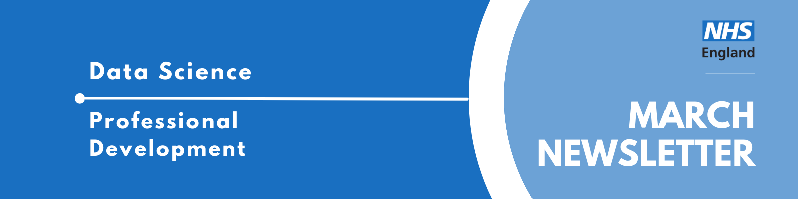

Welcome to the latest newsletter from the Data Science Community for Health and Care, brought to you by the NHS England Data Science Professional Development Functional Team. 

The newsletter team are always happy to receive constructive feedback, and we invite you to send us any contributions you may have. 

If you cannot access something of interest to you, please [reach out](https://github.com/nhsengland/datascience-pd-newsletter/issues/new){target="_blank"}. 

Thanks for reading! – newsletter team 

# Interview with a Data Scientist - The Fairness Enthusiast

Welcome to another instalment of our "Interview with a Data Scientist" series, where we explore the careers and work of the talented data scientists across our healthcare organisations. We aim to showcase the fantastic individuals who contribute to Data Science within the healthcare sector and provide valuable insights for those considering a career in this field.

Today we're interviewing Konstantin Georgiev, a postdoctoral researcher at the University of Edinburgh's Institute for Neuroscience and Cardiovascular Research and former NHS England Data Science Officer. Konstantin's journey from software engineering in Bulgaria to using multimodal AI for cardiac diagnostics in NHS Scotland offers fascinating insights into the intersection of deep learning, fairness in AI, and real-world healthcare impact.

  
Read more...

### How did you end up in data science in your healthcare organisation? What did you do before, and what really sparked your interest in this field?

My path into health data science felt both quite sudden and incredibly long at the same time, and it certainly wasn't something I ever expected or dreamed of doing!

Everything started off at the Technical University of Varna in Bulgaria in 2015, where I barely passed the informatics entry exam to qualify for my bachelor’s degree! In my first year, the bar was set quite low, and I was highly unmotivated because, apart from programming, as ‘prospective engineers’, we were forced into taking courses in electrical and mechanical engineering, which were notoriously difficult to clear. Quite a few people in our group dropped out, but I just managed to scrape by and move on. 

In my second year, I was quite frustrated with uni life, and I had already made up my mind that if I was going to learn anything meaningful in this life, I needed to reach out to people and find a ‘niche’ that I found genuinely interesting. So, I got in contact with senior developers, looked up their companies, and just started steamrolling through courses (free access to Coursera materials was a game-changer!). 

I took courses on everything from full-stack web development to mobile apps, and then I finally came across my first taste of AI and machine learning. During that time, I completed a short internship in optical character recognition and computer vision, which really opened my eyes to what was possible with AI.

Fast-forward to 2019: I blinked twice and became a software engineering graduate with a competitive European scholarship, and was accepted to study an MSc in Artificial Intelligence at the University of Aberdeen. That's where the healthcare sector came into play, and it really showed me how multi-faceted AI applications can be as products. As part of my dissertation and industrial placement, I collaborated with [Red Star AI](https://redstar.ai/){target="_blank"}, a Scottish healthcare startup, to develop an explainable AI tool for predicting patient outcomes from discharge notes. I built deep text classifiers using CNNs and then wrapped them with the LIME (explainability) framework to highlight which parts of discharge letters contributed most to predictions of mortality and readmission. That project made me realise how much impact AI could have on actual patient care, not just as an academic exercise but as something that could help clinicians make better decisions.

What really hooked me was seeing how routine healthcare data, the kind that's being collected every day across NHS Scotland, could be transformed into actionable insights. After my MSc, it was an easy decision to join the Precision Medicine PhD programme at the University of Edinburgh, as I had already built a foundation in wrangling routine healthcare data and pitching risk prediction algorithms to stakeholders across NHS Scotland. 

My PhD was essentially more of the same, but more focused on building decision-support tools that could drive better care for older people. I worked with some challenging, massive cohorts from NHS Lothian, developing machine learning models (shout-out to XGBoost!) to forecast everything from pre-symptomatic dementia risk up to predicting the exact number of healthcare contacts a patient would need during their hospital stay. 

### Once you joined your healthcare organisation, what was that experience like? What different roles and teams have you been a part of, and how have they shaped your career? 

My healthcare data science journey has been quite multifaceted, which I think has been one of my greatest strengths. Since October 2020, even while doing my PhD, I've been working part-time as a Health Data Scientist with Red Star AI. One of our standout projects was the [Fracture Liaison Service](https://redstar.ai/products/fracture-liaison-service/) for NHS Greater Glasgow & Clyde. We designed XGBoost models predicting fragility fracture risk and built a clinical dashboard that ended up reducing case processing time by 55% and saved physicians 28 hours per week: that's about a full working week freed up to focus on actual patient care. 

Between January and June 2025, I took on a role as a Data Science Officer with NHS England in Edinburgh and Leeds as part of their PhD Data Science Internships programme. This was actually on my second try and towards the end of my PhD, so never feel disheartened if you didn’t get the role! Overall, the job was a fantastic opportunity to dip my toes into NHS England practices and meet a whole network of new people from the NHSE engineering and data science teams. 

I learned about measuring fairness and explainability in multimodal AI for risk prediction. With the mentorship of my wonderful colleague Sophie Martin (now a postdoctoral researcher at UCL, working on some exciting dementia research!), I developed the [MM-HealthFair](https://github.com/nhsengland/mm-healthfair){target="_blank"} framework, an open-source PyTorch framework for understanding bias in deep multimodal fusion using the MIMIC-IV dataset. The toolkit turned out to be so comprehensive that it might’ve overcomplicated our narrative a bit! It incorporated fairness metrics (demographic parity, equalised odds), multimodal feature importance scoring (an extension of Shapley values for multimodal scenarios), and adversarial debiasing strategies. 

For me, this opened up so many potential avenues for researching new methods in fairness-aware learning and the importance of this when we’re talking about applying AI algorithms across our whole population. With the excellent help of my supervisors, Dan Schofield, Jonny Pearson and Jonathan Hope, we showed the many implications this could have for validating AI algorithms across NHS trusts and ensuring equitable implementation of clinical AI, which is even more important now with the wide range of foundation models being developed to solve complex medical tasks.

### What are you currently working on? Are there any projects that you're particularly excited about, or that you feel are making a real difference? What impact are you having?

Since October 2025, I've been a Postdoctoral Researcher at the University of Edinburgh, supported by a British Heart Foundation grant, and since then, I’ve shifted my focus to applying multimodal AI for improving the diagnosis of acute cardiac conditions in clinical practice. I am actively trying to bring together everything I’ve learned from multimodal fusion to fairness assessment into what I'm most excited about right now.

I'm currently developing a novel multimodal foundation model that fuses Electronic Health Records (EHR), electrocardiogram (ECG) waveforms, and chest X-ray (CXR) images to predict acute cardiac conditions in the NHS Lothian (Edinburgh) emergency departments. We're working with a rich cohort of over 170,000 patients from our [DataLoch](https://dataloch.org/){target="_blank"} Heart Disease Registry who experience acute coronary syndrome. The goal is to improve diagnostic precision for myocardial infarction, heart failure, and pulmonary embolism, all conditions that are becoming a major burden on our population, where early, accurate diagnosis is absolutely critical and where current diagnostic pathways can sometimes miss opportunities or order unnecessary tests.

What makes this particularly exciting is that we're not just building another AI model. Using my experience from the MM-HealthFair project, I'm investigating how different multimodal fusion mechanisms affect both diagnostic performance and fairness across socio-demographic groups here in Scotland. Healthcare data notoriously contains biases: whether that's underrepresentation of ethnic groups, age gaps, or socioeconomic deprivation. And if we don't actively address these, our AI systems will perpetuate or even amplify them when we combine multiple modalities together.

The challenge is finding the optimal fusion strategy: do we fuse early at the feature level, late at the decision level, or somewhere in between? How do these choices impact fairness? And can we provide new helpful benchmarks for fairness that researchers can use in their own studies?

The impact I'm hoping to achieve with this project is threefold. First, streamline risk interpretation in complex cardiac presentations: that is, help clinicians quickly identify high-risk patients who need immediate intervention. Second, reduce unnecessary clinical tests by safely ruling out low-risk patients who don't need them, such as an echo when symptoms are not suggestive. Every avoided unnecessary test means lower healthcare costs, reduced patient anxiety, and freed-up resources for those who truly need them. Finally, as you might’ve guessed: fairness!! And this will ensure that the patient population is not being systematically disadvantaged by the AI system.

### Looking back on your time in your healthcare organisations Data Science team, what were the most impactful moments? How do you reflect on that experience now?

One of the standout moments from my time with the NHS England Data Science team was seeing MM-HealthFair grow from a rough idea in a notebook to a fully fledged open-source framework that other people in the NHS could install, run, and critique. It was the first time I’d built a toolkit with so many complex components covering fairness, explainability, and multimodal performance, all treated as coequal design goals rather than add-ons, and watching colleagues stress-test it against real clinical questions made the work feel very concrete. 

I also really valued the internal discussions around “what good looks like” for AI in the NHS: meaning not just AUROC, but questions about protected characteristics, deployment risk, and how to communicate limitations to non-technical teams. Those conversations, plus the chance to contribute something reusable to the wider NHSE GitHub ecosystem, were easily the most meaningful parts of the internship for me.

Professionally, the experience pushed me to level up my data science skills and critical thinking (especially important in academia). I became much more rigorous about reproducibility and engineering standards. I deepened my understanding of fairness methodology in a very practical sense: thinking carefully about model trade-offs and how to explain them to clinicians. Finally, I got better at stakeholder communication: translating fairly involved multimodal fusion explanations into something that clinical and policy colleagues could challenge, and ultimately see value in.

### If you could give someone just starting out in data science a few pieces of advice, what would they be? And what resources have you found particularly helpful along the way that you can share?

My first piece of advice would be not to focus too much on resources, but to build a mindset: build a strong foundation, sure, but also don’t forget to seek advice while you’re at it. Read papers, talk to healthcare professionals, talk to programme managers who lead initiatives you’re interested in, and even shadow clinicians in their work if you can. I think the best data science in healthcare happens at the intersection of technical excellence and collaboration.

Also, try to put everything you do out in the open (I need to take this advice as well, as it’s not so easy with closed research environments!). Build projects, contribute to open source, and make your code available on GitHub. I feel that this often encourages you to write clean, well-documented code and to think carefully about how others will use your work.

Try to think about the full project lifecycle and not just the exciting modelling bit. Yes, XGBoost and PyTorch are powerful tools, but you'll spend far more time on data extraction, cleaning, feature engineering, and validation than on tuning hyperparameters. Learn to work with messy real-world data. My experience setting up big data pipelines (e.g., MLOps), whether it's extracting features from MIMIC-IV or working with real Scottish Morbidity Records from multiple NHS health boards, has been just as valuable, if not more so, than my modelling skills.

We have unprecedented amounts of data, powerful computational tools, and growing recognition from healthcare systems that AI can genuinely improve patient outcomes. But we also need to do it responsibly, and that creates many opportunities to take on exciting projects.

___

We hope you have found Konstantin’s interview insightful! If you are interested in learning more about the Data Scientists working in healthcare, you can read our previous iterations of the ["Interview with a Data Scientist"](https://nhsengland.github.io/datascience/articles/category/data-science-interviews/) on the NHS England Data Science Website.

___

# March Analyst X Data Science Huddle

Recently, we had our March Analyst X Data Science Huddle!

We heard from two projects:

* A Semi-Automated Annotation Workflow for Medical Reports Using Small Language Models
* Domain-Specific LLM Evaluation on Open-Ended Generation Tasks Presented

As always, thank you to our presenters for sharing their interesting work!

Missed the session? [Check out the recording and PowerPoint slides here](https://future.nhs.uk/DataAnalytics/view?objectID=56936784){target="_blank"}, where you will also find the recordings of previous huddles. 

___

# April Analyst X Data Science Huddle

**Tuesday 28th April 2026, 13:30 - 14:30, Online**

Thank you for those who have shown interest in presenting at an Analyst X Data Science Huddle! 

The Data Science Community for Health and Care have organised the next Analyst X Data Science Huddle for March. The session will contain two slots, covering two projects:

* Slot 1 (13:30 - 14:00): Leveraging Data Science to Support a District General Hospital (DGH) Presented by Abhinav Gupta

* Slot 2 (14:00 - 14:30): How I adapted the NHSR Waiting List package for Community Waits and how it could be used in other areas Presented by Simon Wellesley-Miller

This will be sent out on Monday 30th of March with further details.

If you would like to be invited to future events of ours, [sign up to our mailing list!](https://forms.office.com/pages/responsepage.aspx?id=slTDN7CF9UeyIge0jXdO48pr_29hyJFKpCZ7SYYvjeFUNUVPMUk0STlDRlJMNklIWEI3V0NZVTZXVS4u&route=shorturl){target="_blank"} 

___

# Synthetic Clinical Notes Work - Now Published!

On January 20th, we had Ben Wallace and Will Poulett present their work at one of our Analyst X Data Science Huddles: **“Generating Synthetic Patient Pathways and Clinical Notes Using LLMs.”** A recording can be accessed [here](https://future.nhs.uk/DataAnalytics/view?objectID=56936784).

As you might remember, they mentioned they were working on getting their work published. It is now available on GitHub: 

[https://github.com/nhsengland/synthetic_clinical_notes](https://github.com/nhsengland/synthetic_clinical_notes/blob/main/README.md)

If you have any questions about the codebase, you can contact Will at [william.poulett1@nhs.net](mailto:william.poulett1@nhs.net) or Scarlett at [scarlett.kynoch1@nhs.net](mailto:scarlett.kynoch1@nhs.net) .

___

# Events

Lots of exciting things coming up! See the [full calendar here](https://future.nhs.uk/DataAnalytics/view?objectID=861745){target="_blank"}, and a small selection below.

### [Art of the possible: LLM-enhanced research methods for large scale qualitative data](https://www.lse.ac.uk/dsi/events/2025-26/research-events/art-of-the-possible){target="_blank"}
**Wednesday 1st April, 12:30 - 14:00, London School of Economics COL.1.06**

LLMs provide unprecedented potential for analysing qualitative data at scale, but that potential cannot be achieved with ad-hoc chatbot interactions. We need structured, rigorous and auditable pipelines.

In this talk, Lee Mager, DSI Faculty Affiliate and Digital Innovation Lead at LSE Law School, draws on three large-scale research projects which:

classify 100,000+ foreign investment projects against EU sustainability criteria
code corporate governance documents from S&P 500 companies’ SEC filings across 25 years
comparative analysis of news media discourse on critical raw materials

### [Turing-Roche festival: Exploring Health AI in Practice](https://www.turing.ac.uk/events/turing-roche-festival-exploring-health-ai-practice){target="_blank"}
**Tuesday 7th Apr 2026, 14:00 - 17:00, Online & Alan Turing Institute**

This festival includes talks from Dr. Hatim Abdulhussein, Samiran Dey, and a presentation from the Turing-Roche enrichment students Reed Naidoo, Jingyu Hu and Giuseppe Tripodi. There will also be time for networking and collaboration.

* 2pm-2.15pm - Introduction to speakers and the Turing-Roche partnership

* 2.15pm-3pm - AI in Practice: NHS Experiences and How to Engage, a talk by Hatim Abdulhussein

* 3pm-3.30pm - tea/coffee break

* 3.30pm-4pm -  Crossmodal generative AI for multimodal cancer data, a talk by Samiran Dey

* 4pm-4.30pm - A talk on Multimodal Cancer AI by the Turing-Roche enrichment students: Reed Naidoo, Jingyu Hu and Giuseppe Tripodi

* 4.30pm-5pm - Networking and further discussion over snacks.

This event is free to attend but you need to register.

### [The Turing Lectures: Frontier AI under pressure - building resilience across layers](https://www.turing.ac.uk/events/turing-lectures-frontier-ai-under-pressure-building-resilience-across-layers){target="_blank"}
**Tuesday 28th Apr 2026, 18:00 - 21:00, Online & British Library, Knowledge Centre, London**

The Alan Turing Institute’s flagship public lecture series returns for its 10th year, bringing world-leading thinking in data science and AI to the forefront of national conversation.

Frontier AI – highly advanced AI systems, such as GPT-5 or DeepMind’s Gemini, that push the limits of what machines can do – is moving faster than our institutions can keep up. This creates challenges that aren’t just technical, but affect the whole system, including AI models, policies, organisations and human decision-making.

Join us for the first of our Turing Lectures to explore resilience not as a simple technical fix, but as a broader challenge that spans AI, institutions, policy and human judgement.

Tickets for this event are free if you attend the livestream, and £12 if you attend in person.

### [The Turing Lectures: Making AI (truly) sustainable - from environmental costs to social impacts](https://www.turing.ac.uk/events/turing-lectures-making-ai-truly-sustainable-environmental-costs-social-impacts){target="_blank"}
**Wednesday 27th May 2026, 18:00 - 21:00, Online & British Library, Knowledge Centre, London**

It’s not news that AI has an environmental impact, and, as training models expand, so does the strain they place on the environment and energy grids around the world.

AI models can transform society – improving efficiency, reducing wasted resources and accelerating innovation. Behind every model trained, every query processed and every dataset stored, though, lies a complex web of environmental, economic and social impacts.

Dr Sasha Luccioni, Climate Lead at global responsible AI start-up Hugging Face, has featured on Business Insider's AI Power List for two years running, given two highly watched TED Talks on AI and, in 2024, was featured in both the BBC’s 100 inspiring and influential women from around the world and TIME Magazine's 100 most influential people in AI lists.

Join us for an evening of insight and discussion where Sasha leads us through solid, evidence-based steps the AI ecosystem can take towards true sustainability. 

Tickets for this event are free if you attend the livestream, and £12 if you attend in person.

___

See more future events on the [calendar](https://future.nhs.uk/DataAnalytics/view?objectID=861745){target="_blank"}

Know of any events we should feature next month? Let us know by clicking the "Contribute" button, or [here](https://github.com/nhsengland/datascience-pd-newsletter/issues/new?assignees=&labels=&projects=&template=suggest-some-newsletter-content-.md&title=){target="_blank"}.

___

Check out our collection of training resources in the [Resources Section](https://future.nhs.uk/DataAnalytics/view?objectID=861745){target="_blank"}! Can you spot something missing? [Contact us](mailto:datascience@nhs.net)!

# Need a Quick Break?

[How many tries will it take you?](https://mywordle.strivemath.com/?word=psipd){target="_blank"}

[Subscribe to the community](https://forms.office.com/pages/responsepage.aspx?id=slTDN7CF9UeyIge0jXdO48pr_29hyJFKpCZ7SYYvjeFUNUVPMUk0STlDRlJMNklIWEI3V0NZVTZXVS4u&route=shorturl){.btn-action-primary .btn-action .btn .btn-success .btn-lg role="button"}[Contribute](https://github.com/nhsengland/datascience-pd-newsletter/issues/new?assignees=&labels=&projects=&template=suggest-some-newsletter-content-.md&title=){.btn-action-primary .btn-action .btn .btn-info .btn-lg role="button" target="_blank"}[PDF Version](./newsletter.pdf){.btn-action-primary .btn-action .btn .btn-info .btn-lg role="button" target="_blank"}

