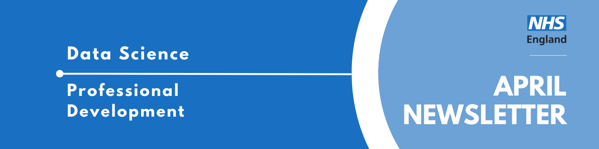

Welcome to the latest newsletter from the Data Science Community for Health and Care, brought to you by the NHS England Data Science Professional Development Functional Team. 

The newsletter team are always happy to receive constructive feedback, and we invite you to send us any contributions you may have. 

If you cannot access something of interest to you, please [reach out](https://github.com/nhsengland/datascience-pd-newsletter/issues/new){target="_blank"}. 

Thanks for reading! – newsletter team 

# Interview with a Data Scientist  - The Epidemiologist Who Wasn’t “Good at Maths”

Welcome to another instalment of our "Interview with a Data Scientist" series, where we explore the careers and work of the talented data scientists across our healthcare organisations. We aim to showcase the fantastic individuals who contribute to Data Science within the healthcare sector and provide valuable insights for those considering a career in this field.

Today we're interviewing Jamie Wong, a postdoctoral researcher at University College London and former NHS England Data Science Officer. 

  
Read more...

### How did you end up in data science in your healthcare organisation? What did you do before, and what really sparked your interest in this field?

For a long time, I wasn’t sure what I wanted to pursue as a career. At school, there wasn’t a particular subject I felt deeply passionate about, and maths certainly wasn’t high on the list. One of my earliest memories is my mum getting frustrated with me in primary school because I couldn’t “evenly distribute fifty people between two buses.” At that point, a future in a quantitative field seemed highly unlikely.

What I did know, however, was that I was deeply interested in health and disease. I was fascinated by stories such as John Snow tracing the source of cholera in 19th century London, and Florence Nightingale using innovative data visualisations to expose preventable deaths during the Crimean War. The SARS outbreak in the early 2000s, which heavily affected my home city of Hong Kong, was also formative. It made me want to pursue a career where I could contribute to strengthening health systems and informing policy in the face of public health crises.

Although I briefly considered medicine, I realised I was increasingly drawn to influencing health at a systems and population level rather than through individual clinical encounters. What appealed to me most was the idea of generating evidence that could shape clinical decisions, inform policy, and ultimately drive improvements in health outcomes.

That curiosity led me to study the then relatively new Population Health programme at UCL. During the first week, we were offered the option to enrol onto a data science pathway. I remember seeing examples of the kinds of visualisations we would be able to produce by the end of the course and being genuinely impressed. I have always enjoyed tinkering with computers, so I thought, why not give it a try?

From there, things accelerated. It certainly wasn’t easy, as there were many frustrating evenings spent troubleshooting R code and grappling with complex statistical concepts (long before large language models were around to help). However, what made the difference was realising that these were tools I could use to answer real world questions and help improve healthcare services across the country. That understanding made the hard parts worthwhile. I went on to complete my BSc in Population Health Sciences (Data Science), then an MSc in Epidemiology at LSHTM with NIHR funding, and I am now halfway through an MRC-funded PhD!

Along the way, I had the opportunity to support research in areas ranging from cancer treatment repurposing and obesity policy to air pollution and STI research. However, it wasn’t until my PhD that I was properly introduced to the area that now underpins much of my work: causal inference.

We all reason about causality in everyday life. Most of us would recognise that too many pints on a Friday night out are likely to result in regret the next morning. The challenge in healthcare, however, is applying that same logic rigorously to complex real world data. There is enormous potential to embed stronger causal methods within the NHS’s analytical pipelines, particularly when evaluating services and interventions in the absence of randomised controlled trials.

At just the right time, the NHS England Data Science and Applied AI Team had posted an opening for a PhD internship project titled “Causal Inference to Estimate the Impact of Interventions.” Just one year into my PhD, I had nothing to lose, so I applied. It turned out to be one of the best decisions I’ve made so far.

### Once you joined your healthcare organisation, what was that experience like? What different roles and teams have you been a part of, and how have they shaped your career?

Once I started my PhD internship as a Data Science Officer within NHS England, I was embedded within the North Central London ICB’s Data Science Team. While formally part of the national Data Science and Applied AI Team, my day to day work was conducted alongside the ICB’s local data scientists to explore whether routinely collected data from local healthcare providers could support causal evaluations of service changes. I was given access to data submitted directly by GP practices, hospitals, and other providers to retrospectively assess the impact of interventions that had previously been implemented within the ICB.

It wasn’t until I began this work that I fully appreciated how challenging it can be to use pre-existing healthcare data for performing impact evaluations. As part of my previous roles, I had worked with electronic health records from sources such as the Clinical Practice Research Datalink (CPRD). Although such datasets were not always originally collected for research purposes, the infrastructure around them was built with secondary analysis in mind.

In contrast, local level NHS data is often designed primarily for monitoring rather than retrospective evaluation. That meant constant conversations with data scientists, analysts, engineers, clinicians, and other stakeholders to understand exactly what was being captured, what was missing, and what limitations would need to be acknowledged when presenting results.

This experience made me realise that applied data science in healthcare is not simply about employing sophisticated study designs or advanced statistical models. Rather, it is a deeply collaborative process that involves engaging with data owners and domain experts to understand how data were generated, how patient cohorts and condition definitions evolve over time, and what limitations these factors may impose on the conclusions you are able to draw.

Rather than dissuading me from continuing down this path though, the experience strengthened my desire to pursue data science as a career. Despite the number of hurdles we had to navigate, we were able to draw clear conclusions about the interventions I was evaluating and inform future commissioning decisions in the process.

### What are you currently working on? Are there any projects that you're particularly excited about, or that you feel are making a real difference? What impact are you having?

After completing my PhD internship, I was given the opportunity to stay on as an Honorary Data Scientist at the North Central London ICB and am now integrating this work into my PhD thesis. I am currently planning further evaluations of additional service changes across the ICB, and with the merger into the West and North London ICB, we now have opportunities to conduct cross ICB comparisons, which is particularly exciting from a methodological perspective.

Alongside this, I am developing practical guidance on applying causal methods within healthcare settings. My work within the ICB serves as real world case studies that others can hopefully use as a reference when conducting their own evaluations. The resource is titled “Causal Inference for Intervention & Service Evaluations: A Practical Handbook” and is freely available online at [causal handbook GitHub](https://nhsengland.github.io/causal-handbook/){target="_blank"} . The core background material and selected methods are now live, with additional case studies to follow in the coming months.

In parallel, I now also serve as Sarcoma Cancer Data Analyst, jointly based between the NHS England National Disease Registry Service and UCL Cancer Institute, investigating variations in diagnostic pathways and access to specialist care for sarcoma patients across England, with the ultimate aim still being to improve health outcomes and reduce health inequalities.

### If you could give someone just starting out in data science a few pieces of advice, what would they be? And what resources have you found particularly helpful along the way that you can share?

One of the main misconceptions I’ve encountered both among students I’ve taught and colleagues I’ve worked with is that you need to be mathematically gifted to enter the field of data science. In reality, more often than not, I’ve found that it’s those with the most curiosity and the strongest desire to answer real world questions who go on to succeed.

Of course, quantitative skills matter, and developing a strong statistical foundation is necessary. However, I personally believe that this is secondary to being curious, constantly asking questions, and being willing to unpick the fine details behind the study designs or models you’ve created. Most importantly, it’s about being able to effectively explain your work, especially to non-technical audiences.

In fact, I’ve found that needing more time during my studies to fully grasp statistical concepts ultimately strengthened my ability to communicate them clearly. While some of my peers seemed to understand certain concepts very quickly, I often had to sit with them longer and repeatedly work through examples before they finally clicked in my head. That process, although frustrating at the time, forced me to build a deeper understanding of the content.

Because of that, I now find it easier to explain complex ideas in a way that others can follow. Many students and colleagues, myself included, who have taken longer to grasp the fundamentals are often better positioned to break down technical methods into language that is accessible to a wider audience. This is particularly important in healthcare. You may spend weeks wrangling data and refining your analyses, but the work only has impact if clinicians, commissioners, policymakers, or patients are able to understand the value and implications of what you have produced.

Resilience is equally important. It would take a lifetime to master the intricacies of every statistical or data science method. Methods change over time, applications differ by context, and no one is able to be a specialist at everything. Embracing the slow and gradual process of learning to code and grappling with statistical concepts is integral. It’s something I always emphasise to students who are struggling, especially in the early stages of learning to use statistical packages such as R or Stata. The learning compounds over time, and what once felt impossible gradually becomes intuitive, which was certainly my own experience.

As someone who mainly uses R in my day to day work, the two resources I always recommend to those starting out are the [“R for Data Science”](https://r4ds.hadley.nz/){target="_blank"}, and for those with a particular interest in applied epidemiology like myself, [“The Epidemiologist R Handbook”](https://www.epirhandbook.com/){target="_blank"}. Both provide clear and practical explanations alongside sample code and output that make it easier to learn by doing.

And, with a small and slightly shameless self-plug, if you are interested in causal inference, I would also point towards my practical handbook I mentioned previously, which will hopefully serve as a good introduction into the field of causal inference, and point you towards additional resources which are more relevant to the specific type of question(s) you’re trying to answer.

___

We hope you have found Jamie interview insightful! If you are interested in learning more about the Data Scientists working in healthcare, you can read our previous iterations of the ["Interview with a Data Scientist"](https://nhsengland.github.io/datascience/articles/category/data-science-interviews/) on the NHS England Data Science Website.

___

# April Analyst X Data Science Huddle

Recently, we had our April Analyst X Data Science Huddle!

We heard from two projects:

* Leveraging Data Science to Support a District General Hospital (DGH) Presented by Abhinav Gupta
* How I adapted the NHSR Waiting List package for Community Waits and how it could be used in other areas Presented by Simon Wellesley-Miller

As always, thank you to our presenters for sharing their interesting work!

Missed the session? [Check out the recording and PowerPoint slides here](https://future.nhs.uk/DataAnalytics/view?objectID=56936784){target="_blank"}, where you will also find the recordings of previous huddles. 

___

# May Analyst X Data Science Huddle

**Tuesday 26th May 2026, 13:30 - 14:30, Online**

Thank you for those who have shown interest in presenting at an Analyst X Data Science Huddle! 

The Data Science Community for Health and Care have organised the next Analyst X Data Science Huddle for May. The session will contain two slots, covering two projects:

* **Slot 1 (13:30 - 14:00): Predictive AI: Likelihood of Discharge Presented by Abdul Hussain**

This session will cover the evaluation and implementation of Epic's Likelihood
 of Discharge model deployed within the Epic EHR to predict inpatient discharge probability for either today or tomorrow. 
 
 We will walk through the full validation pathway from localisation through retrospective and prospective evaluation, and discuss the operational
 framework for integrating model outputs into clinical workflows.

* **Slot 2 (14:00 - 14:30): Utilising User-Centred Design to Develop an OPEL Forecasting Tool Presented by Tess Weaver**

The Operational Pressures Escalation Level (OPEL) Framework is designed to manage operational pressures across NHS providers, including acute trusts, through OPEL scores. Currently, responses to OPEL scores are more reactive than proactive. 

We are exploring the feasibility of a forecasting tool to help operational staff proactively plan for, and ideally avoid, high demand pressures. We have been working with User-Centred Design (UCD) researchers to understand what would make forecasts actionable and useable for our users, so we can deliver maximum impact. 

This presentation will walk you through some of our work on OPEL forecasting, the process of working with UCD researchers, and the impact this has had on the project.

If you would like to be invited to future events of ours, [sign up to our mailing list!](https://forms.office.com/pages/responsepage.aspx?id=slTDN7CF9UeyIge0jXdO48pr_29hyJFKpCZ7SYYvjeFUNUVPMUk0STlDRlJMNklIWEI3V0NZVTZXVS4u&route=shorturl){target="_blank"} 

___

# Events

Lots of exciting things coming up! See the [full calendar here](https://future.nhs.uk/DataAnalytics/view?objectID=861745){target="_blank"}, and a small selection below.

### [Rapid evaluation in health care 2026](https://www.health.org.uk/events/rapid-evaluation-in-health-care-2026){target="_blank"}
**Wednesday 13th May 2026, 09:30 - 16:30, British Medical Asssociation, Tavistock Square, London, WC1H 9JP**

The Rapid evaluation conference, organised by the Nuffield Trust and the Health Foundation's Improvement Analytics Unit, will take place on Wednesday 13 May 2026 at the British Medical Association. 

Now in its eighth year, the conference will bring together representatives from the rapid evaluation community, including analysts, evaluators, service users, policy makers, commissioners and local decision makers to explore the role of rapid evaluation in a changing health and social care landscape. ​

As the NHS and social care system enter a period of significant change to its structures and ambitions, in line with the shifts signalled in the 10-Year Plan, the demands on rapid evaluation are shifting. ​Political and commissioning pressures for swift action continue to grow, yet the need for robust, timely evidence across health and care has never been greater. Rapid evaluation can play a vital role in guiding decision-making during periods of uncertainty, but it may also be perceived as slowing momentum at a time when systems and services are eager to move forward.

Join us to discuss current and future challenges, engage in new thinking and develop ideas that can help improve systems and processes.

Follow the link to register for the event!

### [The Turing Lectures: Making AI (truly) sustainable - from environmental costs to social impacts](https://www.turing.ac.uk/events/turing-lectures-making-ai-truly-sustainable-environmental-costs-social-impacts){target="_blank"}
**Wednesday 27th May 2026, 18:00 - 21:00, Online & British Library, Knowledge Centre, London**

It’s not news that AI has an environmental impact, and, as training models expand, so does the strain they place on the environment and energy grids around the world.

AI models can transform society – improving efficiency, reducing wasted resources and accelerating innovation. Behind every model trained, every query processed and every dataset stored, though, lies a complex web of environmental, economic and social impacts.

Dr Sasha Luccioni, Climate Lead at global responsible AI start-up Hugging Face, has featured on Business Insider's AI Power List for two years running, given two highly watched TED Talks on AI and, in 2024, was featured in both the BBC’s 100 inspiring and influential women from around the world and TIME Magazine's 100 most influential people in AI lists.

Join us for an evening of insight and discussion where Sasha leads us through solid, evidence-based steps the AI ecosystem can take towards true sustainability. 

Tickets for this event are free if you attend the livestream, and £12 if you attend in person.

___

See more future events on the [calendar](https://future.nhs.uk/DataAnalytics/view?objectID=861745){target="_blank"}

Know of any events we should feature next month? Let us know by clicking the "Contribute" button, or [here](https://github.com/nhsengland/datascience-pd-newsletter/issues/new?assignees=&labels=&projects=&template=suggest-some-newsletter-content-.md&title=){target="_blank"}.

___

Check out our collection of training resources in the [Resources Section](https://future.nhs.uk/DataAnalytics/view?objectID=861745){target="_blank"}! Can you spot something missing? [Contact us](mailto:datascience@nhs.net)!

# Need a Quick Break?

[How many tries will it take you?](https://mywordle.strivemath.com/?word=ohfup){target="_blank"}

[Subscribe to the community](https://forms.office.com/pages/responsepage.aspx?id=slTDN7CF9UeyIge0jXdO48pr_29hyJFKpCZ7SYYvjeFUNUVPMUk0STlDRlJMNklIWEI3V0NZVTZXVS4u&route=shorturl){.btn-action-primary .btn-action .btn .btn-success .btn-lg role="button"}[Contribute](https://github.com/nhsengland/datascience-pd-newsletter/issues/new?assignees=&labels=&projects=&template=suggest-some-newsletter-content-.md&title=){.btn-action-primary .btn-action .btn .btn-info .btn-lg role="button" target="_blank"}[PDF Version](./newsletter.pdf){.btn-action-primary .btn-action .btn .btn-info .btn-lg role="button" target="_blank"}

