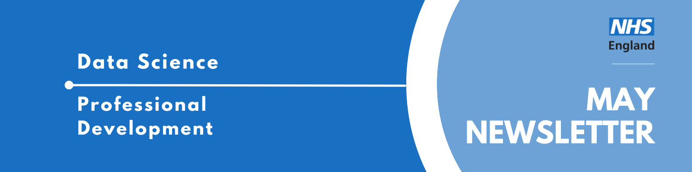

Welcome to the latest newsletter from the Data Science Community for Health and Care, brought to you by the NHS England Data Science Professional Development Functional Team. 

The newsletter team are always happy to receive constructive feedback, and we invite you to send us any contributions you may have. 

If you cannot access something of interest to you, please [reach out](https://github.com/nhsengland/datascience-pd-newsletter/issues/new){target="_blank"}. 

Thanks for reading! – newsletter team 

# Interview with a Data Scientist  - Dungeons, dragons and data

Welcome to another instalment of our "Interview with a Data Scientist" series, where we explore the careers and work of the talented data scientists across our healthcare organisations. We aim to showcase the fantastic individuals who contribute to Data Science within the healthcare sector and provide valuable insights for those considering a career in this field.

Today we're interviewing Simon Wellesley-Miller, a Senior Analytical Manager in the Insights & Intelligence Team at NHS England South West. 

  
Read more...

### How did you end up in data science in your healthcare organisation? What did you do before, and what really sparked your interest in this field?

I had worked with data for about 10 years before I jumped into data science, working across child protection data, police and then coming into the NHS. Before my data roles I had various jobs including DVLA court prosecutor and professional goblin (yes I was really a paid goblin!).

My previous data roles were very traditional KPI reporting and report building. I was not great at SQL and took on a multitude of very manual processes to build not very insightful reports. Working with data, I always knew there was better things we could do with it but was very unsure how to do it. I was very fortunate geographically working in Exeter, that my trust had good links with the university. I was fortunate to be chosen to provide some data for a collaborate university project. This really opened my eyes to the art of the possible with data. Again, I was lucky in that the university had a strong PenARC Operational Research and Data Science Team and they were the founders of the Health Service Modelling Associates (HSMA) programme, which teaches analysts the foundations of data science and operational research. I was lucky enough to be on one of the very early cohorts.

My project for HSMA was a discrete event simulation that supported a massive investment in Crisis Cafes for support of mental health services in Devon. The HSMA really gave me a taste for data science and 2 years later Exeter University started its first MSC in Healthcare Data Science and I was keen to get on. Despite not having a bachelor’s degree, I was accepted on merit and jumped straight into the course. As a more mature student and never having done university properly and still having to work a full-time job, it was certainly a challenge but one I loved, and I got great support from the Uni and my peers. I really see data science as a great accompaniment to performance reporting, to dig into the why things are happening but far more importantly what do we think will happen, what impact to we predict mitigations will have and how we can improve our services for our patients. I love it when I see tangible actions arise from a project and bring clinically meaningful insights into my work.

### Once you joined your healthcare organisation, what was that experience like? What different roles and teams have you been a part of, and how have they shaped your career?

I have worked for the NHS for nearly 12 years. The first 7 of those were in a mental health provider. I started as a senior information analyst and my main task was to set up performance reporting for a brand-new dementia service in Bristol, sorting out data flows and designing new metrics and KPIs for the service. After about 3 years I was promoted to information manager and was responsible for things such as the trusts integrated performance report (IPR), I used this as an opportunity to introduce things such as statistical process control (SPC) into reports. This was also the around start of the covid which meant there was huge amounts of pressure to produce sit reps and collate new data from new sources. I used this as an opportunity to up my R skills and develop processes that could load in multiple different sources and blend the data and produce the summaries in an automated fashion, changing what was a daily 3 hour manual mistake ridden process into a 5 minute slick one.

I also got involved in the wider OA community and helped build the NHS-R plot the dots package to build SPC charts, which I utilised into a new workflow for our IPR which again changed a process that took days into one that took minutes. Also during covid is when I started my part time MSc in Healthcare Data Science and just before starting my second year, I managed to secure a Senior Analytical Manager role in the South West Region, Insights and Intelligence Team. I have worked across many areas whilst at NHSE, including working with the elective recovery team on a health inequalities project and geographical modelling for public health.

### What are you currently working on? Are there any projects that you're particularly excited about, or that you feel are making a real difference? What impact are you having?

I am currently working on a high-level demand and capacity model for diagnostic pathways. This is based on some previous work I have completed on community waiting lists and hope to transfer a similar methodology to this dataset and build on lessons learned from that project. This will be useful for strategic demand management and support investment and commissioning decisions, which in turn should mean better access for patients. 

I have also recently finished a nice side quest on a geographical modelling problem, looking at placement of diabetic eye screening cameras to optimise placement of new cameras based on travel times, prevalence within population and utilised some lovely pretty maps and some fun permutation loops. Not something I had done since my masters and was nice to do something challenging. Again nice to see that this had direct impact on commissioning and supported optimal positioning to improve outcomes for patients. 

I think my motivation and passion for my role is when I can link my work to making improvements for patients. I am no doctor (hate the sight of blood), but get a lovely warm fuzzy feeling when I can use my skills to improve services. I am also very keen that others do the same and work hard to upskill and encourage others to do similar. 

I offer my time to the NHS-OA community and run (and design) training courses in R across the NHS. I do have some knowledge of python, but most of my work is in R. I just find the tidyverse so lovely to work with and stats and things are just so much easier. It is not as versatile and maybe not as cool for neural networks and stuff, but I find I like to keep my models interpretable and insights grounded. I do need to get to grips with more pyspark and it's on my to do list. I have championed the use of R and have lobbied to get R connect licenses available for use in the FDP. These are now available and we are testing out how R can be used within FDP to deploy shiny apps and automated reporting. The potential for this is super exciting.

I am a great believer in delivering insights from data and making things interpretable and useful. I have done multiple national talks on data visualisation techniques and getting the message out first and then supporting it with data, rather than presenting data and expecting the audience to find the message. I have several inspirations that I follow, such as Alberto Cairo, Nicola Rennie and Cara Thompson and try to keep up to date with new techniques.

### If you could give someone just starting out in data science a few pieces of advice, what would they be? And what resources have you found particularly helpful along the way that you can share?

My advice for aspiring data scientists is to try to keep things as simple as possible, something that you have confidence in and can explain has far more power than a black box output. Work with your stakeholders and dig to get to the real analytical question they want answers to. They may ask for how many beds were open last Tuesday but what they really want to know is how many beds will I need next Tuesday. 

Domain knowledge is also something not to be underestimated. Make sure you understand the complexities and issues within the data you are working with, try to speak to those closest to the source to understand what it really means. Build networks of clever people you can steal ideas from, I mean collaborate and share best practice with. Don’t feel that everything must be started from scratch. See what is already out there, and as part of that make sure you put what you do out there so that others can learn from you. When I didn’t have much peer support, I started running a coffee and code community. This is great place to show off what you are doing, see the art of the possible that other people have done and ask for help, assistance and peer review. Getting involved in communities pays back more than you put in. I would shout out to the NHS-OA community and APHA (Association of Professional Healthcare Analysts), which are two communities I am involved in. 

I am an unashamed Dungeons and Dragons player for a great many years, it has helped with my maths, make great friends and have a bit of harmless escapism. I also paint miniatures and so it is a great way to unwind and be creative. My other hobby is running and, in the past, I completed ultra marathons. I often go for a lunchtime run, zone out and find a way to resolve a coding problem I have been tussling with all morning.

My final words are to treat every day as a school day and be willing be humbled and learn more. I completed my MSc at twice the age of some of other students (yes I am that old!). Keep your eyes on the prize of what the piece of work you are doing is for, what decision is it influencing, what direct impact will it have, what is the call to action it will produce? I honestly love my job and the opportunities it gives me to improve healthcare services for patients and to encourage data peeps of all flavours to have impact by enabling data driven decisions to support patients.

___

We hope you have found Simon's interview insightful! If you are interested in learning more about the Data Scientists working in healthcare, you can read our previous iterations of the ["Interview with a Data Scientist"](https://nhsengland.github.io/datascience/articles/category/data-science-interviews/) on the NHS England Data Science Website.

___

# May Analyst X Data Science Huddle

Recently, we had our May Analyst X Data Science Huddle!

We heard from two projects:

* Predictive AI: Likelihood of Discharge Presented by Abdul Hussain
* Utilising User-Centred Design to Develop an OPEL Forecasting Tool Presented by Tess Weaver

As always, thank you to our presenters for sharing their interesting work!

Missed the session? [Check out the recording and PowerPoint slides here](https://future.nhs.uk/DataAnalytics/view?objectID=56936784){target="_blank"}, where you will also find the recordings of previous huddles. 

___

# June Analyst X Data Science Huddle

**Tuesday 30th June 2026, 13:30 - 14:30, Online**

The Data Science Community for Health and Care have organised the next Analyst X Data Science Huddle for June. We will hear from one project; see the abstract below.

* **Predicting Length of Stay: Explainable, Continuously Updated Discharge Forecasting to Reduce Overstays Presented by Adam Hollings**  

Estimated discharge dates (EDD) are often missing and, when present, are frequently inaccurate — even when predicting discharge within the next 24 hours. This lack of reliability reduces staff confidence in forward planning and can result in patients who are medically optimised for discharge remaining in hospital beds longer than necessary.

We are working directly with a trust to address this problem by developing a model that predicts patient length of stay using admissions, patient, and treatment data from the CDM (Canonical Data Model) within the Federated Data Platform (FDP). A key challenge is the volume and diversity of information feeding into the EDD decision, which makes explainability essential for clinical and operational trust.

The model inference predictions will be able to be updated daily for a patient as new information becomes available. Crucially, the tool will highlight which changes in patient or pathway variables are driving changes in the predicted discharge window, allowing users to understand not just what has changed, but why.

Alongside model development, we have treated integration into user workflows as a first‑class requirement — ensuring outputs are actionable, interpretable, and aligned with how discharge planning decisions are made in practice and the tools they prefer to use. As the tool matures, we are exploring the incorporation of multi‑modal data to further allow the model to meet the users needs and improve predictive performance.

___

# Looking for an interesting read?

Dr Andrew Barnes at the University of Bath is harnessing artificial intelligence to predict storms and extreme weather events all over the world. 

See [Weather wizards: How AI is predicting storms with precision](https://www.bath.ac.uk/case-studies/weather-wizards-how-ai-is-predicting-storms-with-precision/){target="_blank"} and have a read!

___

# Events

Lots of exciting things coming up! See the [full calendar here](https://future.nhs.uk/DataAnalytics/view?objectID=861745){target="_blank"}, and a small selection below.

### [Rethinking research: the role of humans in scientific discovery in the age of LLMs](https://www.lse.ac.uk/dsi/events/2025-26/research-events/rethinking-research){target="_blank"}
**Monday 1st June, 17:30 - 19:00, London School of Economics, MAR 2.04**

Artificial intelligence (AI) and large language models (LLMs) are rapidly reshaping the landscape of scientific discovery. These technologies highlight the significant potential of AI to enhance human scientific capabilities and accelerate research. At the same time, they signal a profound shift in how research is conceived, conducted, and communicated, as well as how doctoral students and researchers are supervised and intellectually developed. This transformation calls for a critical re-examination of the human role in research.

The relationship between humans and AI, and their combined biological and artificial intelligence, must be grounded in mutual critique, trust, and collaboration. Researchers should rigorously evaluate AI-generated outputs using their own expertise and judgment, while also leveraging LLMs to test, challenge, and refine arguments and hypotheses through critical thinking. Such reciprocal co-creation ensures that AI functions as an augmentative partner rather than a replacement in the pursuit of scientific knowledge. It also points toward a shift from a traditional two-way relationship to a three-way partnership involving students, supervisors, and LLMs.

Rather than offering definitive conclusions, this talk seeks to stimulate dialogue, question assumptions, and inspire new forms of collective thinking about the future of scientific research and doctoral training in an AI-driven world.

### [How to talk to AI](https://www.lse.ac.uk/dsi/events/2025-26/public-events/how-to-talk-to-ai){target="_blank"}
**Tuesday 2nd June, 18:00-20:00, Space House, 12 Keeley Street, London, WC2B 4BA**

Hundreds of millions of people now talk AI, every day. Artificial Intelligence has the power to reshape society faster than any technology in modern history. However, most people still don’t understand how these new AI systems work, how to make the most of them, or what the dangers are.

In his new book ‘How to Talk to AI’, award-winning technology writer Jamie Bartlett explores how we actually communicate with these machines, and what happens if we get it wrong.

Jamie is joined by Dr Jon Cardoso-Silva (Assistant Professor at the DSI). They will discuss Bartlett’s new book, and what it really means to communicate effectively with AI.

Event timings:

* Drinks reception from 6.00pm
* Talk begins at 6.30pm

### [From Theory to Impact in Health and Care](https://www.datascienceconnects.com/DataScience/Events/Event_display.aspx?EventKey=HCSJUNE26&WebsiteKey=895c5ac3-48c4-4044-9150-a42812a702d2){target="_blank"}
**Friday 19th June, 13:30 - 17:30, Birmingham**

We are delighted to invite you to an afternoon of insightful discussion and collaborative problem-solving, hosted by the OR Society's Health and Care Systems SIG. Our event brings together practitioners and academics to explore the vital role Operational Research plays in navigating complex health and care system challenges.

The afternoon features two distinguished keynote speakers who will share their expertise in healthcare modeling. Dr Elizabeth Williams, PhD will open the session by sharing her firsthand experience applying optimization methods within NHS Wales. Later, Dr Edilson Arruda who is an Associate Professor at the University of Southampton will close our formal sessions by shifting the lens to a patient-centric approach, exploring how pathway insights can transform our ability to forecast hospital bed occupancy.

Beyond the keynotes, this event is designed for active participation. In our Round-Table Session, attendees are offered the chance to discuss real-world optimization scenarios in small groups. Whether you are new to the field of Operational Research or not, this is a fantastic opportunity to sharpen your skills, share system insights, and network with the wider OR community. 

* OR Society Members - Free
* Non members - £10.00 + VAT

Note - you will need to sign in or create an account to register for this event. 

### [Will AI secure humanity’s future?](https://www.lse.ac.uk/events/lse-festival/2026/will-ai-secure-humanitys-future){target="_blank"}
**Saturday 20th June, 15:30 - 16:30, Online and in-person (Marshall Building, London School of Economics)**

Artificial Intelligence is reshaping our world, transforming economies, societies, daily interactions and the institutions that support them. Many researchers and policymakers view this as a pivotal moment, one that could lead to greater global wellbeing if managed well or to growing instability if risks are left unchecked.

Supporters argue that AI is driving positive change across the world. It is advancing human welfare by making scientific research faster and more reliable, improving diagnostics and treatment in healthcare, and strengthening environmental planning through climate modelling. It is boosting productivity leading to economic growth and helping public services respond more accurately to social needs. Some highlight its potential to widen democratic participation by improving access to information and enabling new forms of civic engagement.

Critics warn that AI presents potentially unsurmountable challenges. Its enormous energy demands will worsen the climate crisis. The inherent biases in its data will perpetuate discrimination and social inequity. The rise of deepfakes and misinformation, will erode trust and kill democracy. In the job market, AI-driven automation will displace roles, reshape careers, and concentrate power and wealth with a limited few. Ultimately the rapid pace of its development and deployment may lead to our inability to govern and control it.

Join us to hear four speakers present their competing viewpoints. Consider the debate, ask questions of the panel and decide whether you are persuaded that AI will really improve our daily lives safeguard the planet and save humanity.

___

See more future events on the [calendar](https://future.nhs.uk/DataAnalytics/view?objectID=861745){target="_blank"}

Know of any events we should feature next month? Let us know by clicking the "Contribute" button, or [here](https://github.com/nhsengland/datascience-pd-newsletter/issues/new?assignees=&labels=&projects=&template=suggest-some-newsletter-content-.md&title=){target="_blank"}.

___

Check out our collection of training resources in the [Resources Section](https://future.nhs.uk/DataAnalytics/view?objectID=861745){target="_blank"}! Can you spot something missing? [Contact us](mailto:datascience@nhs.net)!

# Need a Quick Break?

[How many tries will it take you?](https://mywordle.strivemath.com/?word=bctxd){target="_blank"}

[Subscribe to the community](https://forms.office.com/pages/responsepage.aspx?id=slTDN7CF9UeyIge0jXdO48pr_29hyJFKpCZ7SYYvjeFUNUVPMUk0STlDRlJMNklIWEI3V0NZVTZXVS4u&route=shorturl){.btn-action-primary .btn-action .btn .btn-success .btn-lg role="button"}[Contribute](https://github.com/nhsengland/datascience-pd-newsletter/issues/new?assignees=&labels=&projects=&template=suggest-some-newsletter-content-.md&title=){.btn-action-primary .btn-action .btn .btn-info .btn-lg role="button" target="_blank"}[PDF Version](./newsletter.pdf){.btn-action-primary .btn-action .btn .btn-info .btn-lg role="button" target="_blank"}

