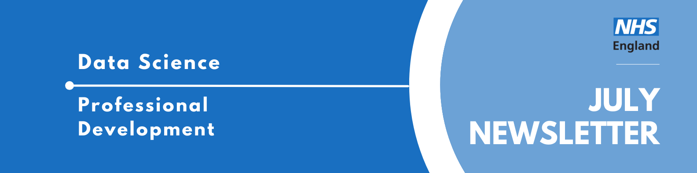

Welcome to the latest newsletter from the Data Science Community for Health and Care, brought to you by the NHS England Data Science Professional Development Functional Team. 

The newsletter team are always happy to receive constructive feedback, and we invite you to send us any contributions you may have. 

If you cannot access something of interest to you, please [reach out](https://github.com/nhsengland/datascience-pd-newsletter/issues/new){target="_blank"}. 

Thanks for reading! – newsletter team 

# July Analyst X Data Science Huddle

Recently, we had our July Analyst X Data Science Huddle!

We heard from two projects:

* Discrete Event Simulation (DES) model to support ADHD and Autism pathway analysis presented by Guled Abdullahi
* Optimising Access to OCT in the Diabetic Eye Screening Digital Surveillance Pathway presented by Simon Wellesley-Miller

As always, thank you to our presenters for sharing their interesting work!

Missed the session? [Check out the recording and PowerPoint slides here](https://future.nhs.uk/DataAnalytics/view?objectID=56936784){target="_blank"}, where you will also find the recordings of previous huddles.

___

# September Analyst X Data Science Huddle

**Tuesday 8th September 2026, 13:30 - 14:00, Online**

The Data Science Community for Health and Care have organised the next Analyst X Data Science Huddle for September. We will hear from one project; see the abstract below.

* **Synthesis: Turning Video Content into Searchable Institutional Memory Presented by Eirini Komninou**

Your team watches hours of webinars, conference talks, and recorded meetings - then that knowledge disappears. Synthesis is a privacy-first pipeline that automatically turns video and audio into a structured, cross-linked, searchable knowledge base, stored on your own infrastructure. This huddle will be presented by Eirini from the Strategy Unit.

___

# Events

Lots of exciting things coming up! See the [full calendar here](https://future.nhs.uk/DataAnalytics/view?objectID=861745){target="_blank"}, and a small selection below.

### [AI in the NHS 2026](https://www.health.org.uk/events/ai-in-the-nhs-2026){target="_blank"}
**Thursday 15 October 2026, 10.00–17.00, Online**

2026 is set to be a pivotal year for AI in the NHS, with important national strategies and regulatory reforms expected that will impact what kinds of technologies get used and how the health service adopts and oversees them.

But turning the vision of an AI-enabled health system into reality won’t be straightforward. Our third annual AI event will bring together stakeholders from across the NHS, government, industry, academia and the charity sector to consider how the NHS can responsibly, safely and effectively implement AI at scale.

This full day event will explore how to:

* translate national strategy into real-world implementation
* evaluate and scale AI tools rapidly, safely and effectively
* build trust among clinicians, patients and the public
* support the workforce through technological transformation
* learn from leading international health systems already using AI at scale.

___

See more future events on the [calendar](https://future.nhs.uk/DataAnalytics/view?objectID=861745){target="_blank"}

Know of any events we should feature next month? Let us know by clicking the "Contribute" button, or [here](https://github.com/nhsengland/datascience-pd-newsletter/issues/new?assignees=&labels=&projects=&template=suggest-some-newsletter-content-.md&title=){target="_blank"}.

___

Check out our collection of training resources in the [Resources Section](https://future.nhs.uk/DataAnalytics/view?objectID=861745){target="_blank"}! Can you spot something missing? [Contact us](mailto:datascience@nhs.net)!

# Need a Quick Break?

[How many tries will it take you?](https://mywordle.strivemath.com/?word=althw){target="_blank"}

[Subscribe to the community](https://forms.office.com/pages/responsepage.aspx?id=slTDN7CF9UeyIge0jXdO48pr_29hyJFKpCZ7SYYvjeFUNUVPMUk0STlDRlJMNklIWEI3V0NZVTZXVS4u&route=shorturl){.btn-action-primary .btn-action .btn .btn-success .btn-lg role="button"}[Contribute](https://github.com/nhsengland/datascience-pd-newsletter/issues/new?assignees=&labels=&projects=&template=suggest-some-newsletter-content-.md&title=){.btn-action-primary .btn-action .btn .btn-info .btn-lg role="button" target="_blank"}[PDF Version](./newsletter.pdf){.btn-action-primary .btn-action .btn .btn-info .btn-lg role="button" target="_blank"}

