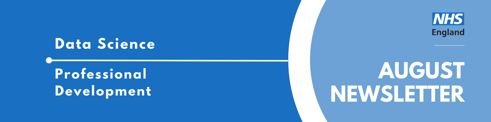

Welcome to the latest newsletter from the Data Science Community for Health and Care, brought to you by the NHS England Data Science Professional Development Functional Team. 

The newsletter team are always happy to receive constructive feedback, and we invite you to send us any contributions you may have. 

If you cannot access something of interest to you, please [reach out](https://github.com/nhsengland/datascience-pd-newsletter/issues/new){target="_blank"}. 

Thanks for reading! – newsletter team 

# September Analyst X Data Science Huddle

**Tuesday 8th September 2026, 13:30 - 14:00, Online**

The Data Science Community for Health and Care have organised the next Analyst X Data Science Huddle for September. We will hear from one project; see the abstract below.

* **Synthesis: Turning Video Content into Searchable Institutional Memory Presented by Eirini Komninou**

Your team watches hours of webinars, conference talks, and recorded meetings - then that knowledge disappears. Synthesis is a privacy-first pipeline that automatically turns video and audio into a structured, cross-linked, searchable knowledge base, stored on your own infrastructure. This huddle will be presented by Eirini from the Strategy Unit.

# October Analyst X Data Science Huddle

**Tuesday 27th October 2026, 13:30 - 14:15, Online**

The Data Science Community for Health and Care have organised the next Analyst X Data Science Huddle for October. We will hear from one project followed by 2 practical examples of how it has been used in the NHS; see the abstract below.

* **Process Mining in the NHS**

A high-level introduction to process mining: what it is, how it works, and how it can be used to understand the way NHS services operate.

This will be followed by 2 practical examples of how it has been used in the NHS.

1. Outpatient Pathway Protocols

This example will demonstrate how process mining is applied to outpatient pathway protocols. By comparing the intended pathway with observed activity, we can identify where follow-up appointments are concentrated, understand how patients move through different pathway variants, and highlight opportunities for providers to focus improvement efforts.

The aim is not to prescribe a single solution, or a single analytical method, but to provide providers with clearer evidence about where opportunities may exist to reduce avoidable follow-ups, improve pathway efficiency, and release capacity as part of their outpatient planning.

2. Understanding Emergency Respiratory Patient Flow - Applying process mining and collaborative analytics to uncover patient flow patterns and identify improvement opportunities

This is presented as an example at Nottingham University Hospitals (NUH) of executing a 'project focused' deep dive to gain insights from our rich set of disparate data.

Buit upon a robust, version-controlled data pipeline, the analysis mapped patient journeys across the respiratory pathway. This included mappings of patient movements, pathway timings, length of stay, occupancy, and daily activity patterns to provide a detailed evidence base for understanding service performance and flow.

A key principle of the project has been close collaboration with clinicians and operational teams. Recognising that data alone does not provide sufficient understanding of clinical pathways, the analysis was delivered through a series of iterative sprints. Regular review sessions enabled findings to be discussed, assumptions challenged, and priorities refined. This approach developed a shared understanding of both the service and the data, while allowing the analytical focus to adapt as new insights emerged.

This helped identify opportunities for service improvement, challenge anecdotal perceptions, as well as providing a foundation that could be built upon for future projects and more advanced predictive modelling.

# Events

Lots of exciting things coming up! See the [full calendar here](https://future.nhs.uk/DataAnalytics/view?objectID=861745){target="_blank"}, and a small selection below. 

### [International Conference on Trustworthy Digital Infrastructure 2026](https://www.turing.ac.uk/events/international-conference-trustworthy-digital-infrastructure-2026){target="_blank"}
**Wednesday 16th September 2026, 10:00-16:00, Courthouse Hotel London Soho and Online**

Digital Public Infrastructure, including foundational systems such as digital identity, payments, data exchange, registries, and public-service platforms, has emerged not merely as a technical undertaking, but as a critical site of contestation over sovereignty, governance, rights, resilience, and public trust.

The rapid adoption of AI intensifies these questions. AI systems are increasingly being used to verify identity, detect fraud, assess risk, automate administrative processes, support cybersecurity monitoring, improve service personalisation, and analyse population-scale data. These capabilities may strengthen DPI by improving efficiency, inclusion, security, and responsiveness. However, they may also introduce new risks around opacity, bias, exclusion, surveillance, accountability, vendor dependency, and democratic oversight. 

It is free to attend online, but there is a few to attend in person.

### [AI in the NHS 2026](https://www.health.org.uk/events/ai-in-the-nhs-2026){target="_blank"}
**Thursday 15 October 2026, 10.00–17.00, Online**

2026 is set to be a pivotal year for AI in the NHS, with important national strategies and regulatory reforms expected that will impact what kinds of technologies get used and how the health service adopts and oversees them.

But turning the vision of an AI-enabled health system into reality won’t be straightforward. Our third annual AI event will bring together stakeholders from across the NHS, government, industry, academia and the charity sector to consider how the NHS can responsibly, safely and effectively implement AI at scale.

This full day event will explore how to:

* translate national strategy into real-world implementation
* evaluate and scale AI tools rapidly, safely and effectively
* build trust among clinicians, patients and the public
* support the workforce through technological transformation
* learn from leading international health systems already using AI at scale.

___

See more future events on the [calendar](https://future.nhs.uk/DataAnalytics/view?objectID=861745){target="_blank"}

Know of any events we should feature next month? Let us know by clicking the "Contribute" button, or [here](https://github.com/nhsengland/datascience-pd-newsletter/issues/new?assignees=&labels=&projects=&template=suggest-some-newsletter-content-.md&title=){target="_blank"}.

___

Check out our collection of training resources in the [Resources Section](https://future.nhs.uk/DataAnalytics/view?objectID=861745){target="_blank"}! Can you spot something missing? [Contact us](mailto:datascience@nhs.net)!

# Need a Quick Break?

[How many tries will it take you?](https://mywordle.strivemath.com/?word=cfrss){target="_blank"}

[Subscribe to the community](https://forms.office.com/pages/responsepage.aspx?id=slTDN7CF9UeyIge0jXdO48pr_29hyJFKpCZ7SYYvjeFUNUVPMUk0STlDRlJMNklIWEI3V0NZVTZXVS4u&route=shorturl){.btn-action-primary .btn-action .btn .btn-success .btn-lg role="button"}[Contribute](https://github.com/nhsengland/datascience-pd-newsletter/issues/new?assignees=&labels=&projects=&template=suggest-some-newsletter-content-.md&title=){.btn-action-primary .btn-action .btn .btn-info .btn-lg role="button" target="_blank"}[PDF Version](./newsletter.pdf){.btn-action-primary .btn-action .btn .btn-info .btn-lg role="button" target="_blank"}

